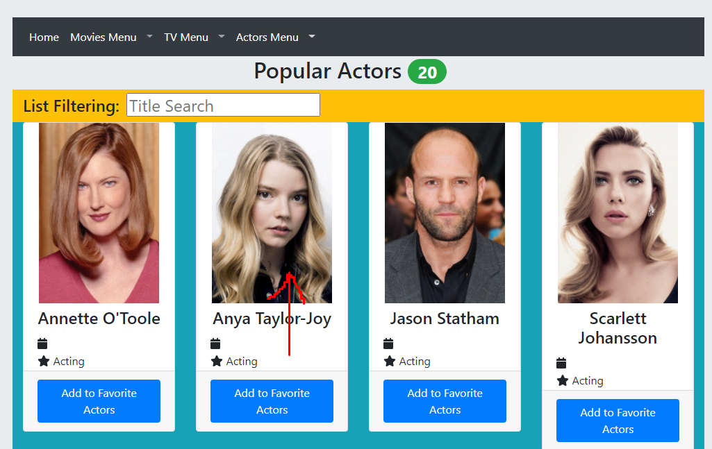

# Assignment 1 - ReactJS app.

Name: Ciarán Crowley

## Features.

...... A bullet-point list of the ADDITIONAL user features you have implemented for the  Movies Fan app ......,
 
 + Feature 1 - Popular Movies:  Displays the movies that are trending on TMDB.
 + Feature 2 - Latest Movies:  Displays the movie most recently added to TMDB.  The latest movie is often missing information as well as its poster due.
 + Feature 3 - Tv Shows:  Displays Tv Shows available on TMDB.  Includes the ability to add favourite tv shows.
 + Feature 4 - Top rated Shows:  Displays the current highest rated shows available on TMDB.  Includes ability to add to a watch list.
 + Feature 5 - People:  Popular Actors page displays the current most popular actors on TMDB.  Includes ability to add favourite actors.
 + Feature 6 - React Nav Bar & Drop Down Menus: Added to declutter the nav bar.

## Setup requirements (If required).

+ npm install
+ npm install cypress --save-dev
+ npm install --save-dev start-server-and-test@1.10.6
+ npm install react-bootstrap bootstrap
+ npm install -g http-server
+ npm start (Google Chrome is required.  You may need to refresh the web app in your browser to get a display)

## API Data Model.

..... List the additional TMDB endpoints used in your assignment, e.g.

....  Movie Endpoints  ....
+ https://api.themoviedb.org/3/movie/${id} - get detailed information on a specific movie. 
+ https://api.themoviedb.org/3/genre/movie/list - get a list of movie genres
+ https://api.themoviedb.org/3/discover/movie - get all movies on TMDB
+ https://api.themoviedb.org/3/movie/${id}/reviews - get reviews for a specific movie
+ https://api.themoviedb.org/3/movie/upcoming - get all upcoming movies on TMDB
+ https://api.themoviedb.org/3/movie/popular - get popular movies on TMDB
+ https://api.themoviedb.org/3/movie/latest = get latest movie added to TMDB

....  Tv Endpoints  ....
+ https://api.themoviedb.org/3/discover/tv - get all tv shows on TMDB
+ https://api.themoviedb.org/3/tv/${id} - get detailed information on a specific tv show
+ https://api.themoviedb.org/3/genre/tv/list - get a list of tv show genres
+ https://api.themoviedb.org/3/tv/${id} - get reviews for a specific tv show
+ https://api.themoviedb.org/3/tv/top_rated - get the current highest rated tv shows on TMDB

....  People Endpoints  ....
+ https://api.themoviedb.org/3/person/popular - get all popular actors on TMDB
+ https://api.themoviedb.org/3/person/${id} - get detailed information on a specific actor

## App Design.

### Component catalogue (If required).

### UI Design.

...... Insert screenshots of the new/modified views you have added to the Movies Fan app. Include a caption for each one clearly stating its purpose and any user interaction it supports ........

>Shows the new nav bar.  This was introduced to declutter the original nav bar as it was getting hard to navigate with so many pages.  Clicking home will take you to "/", and the other options will open drop down menus containing links to related information

>Shows the Movies Menu Drop Down menu.  Clicking on any of the links inside will take you to the corresponding pages.

>Shows the TV Menu Drop Down menu.  Clicking on any of the links inside will take you to the corresponding pages.

>Shows the Actors Menu Drop Down menu.  Clicking on any of the links inside will take you to the corresponding pages.

>Shows detailed information on a movie.  Clicking the 'Show Reviews' button will display extracts from critic reviews.

>Shows detailed information on a tv show.  Clicking the 'Show Reviews' button will display extracts from critic reviews.

>Shows detailed information on an actor.  Clicking the 'Return to Popular Actors" button will take you back to the Popular Actors Page.

>Shows the full text for a movie review. 

## Routing.

...... List of the additional routes supported by your Movies Fan app.

+ / (public) - the home page.  Displays movies available on TMDB.
+ /movies/favorites (protected) - displays the user's favorite movies selection.
+ /reviews/:id (public) - displays the full text of a movie review.
+ /movies/watchList (protected) - displays the movies the user has added to their watch list.
+ /movies/upcoming (public) - displays upcoming movies.
+ /movies/popular (public) - displays the current trending movies on TMDB. 
+ /movies/:id (public) - displays detailed information for a specific movie.
+ /tv (public) - displays the tv shows available on TMDB.
+ /tv/:id - displays detailed information for a specific tv show.
+ /tv/reviews/:id (public) - displays reviews for a specific tv show.
+ /tv/topRated (public) - displays the top rated tv shows on TMDB.
+ /tv/favoriteShows (protected) - displays the users favorite tv show selection.
+ /tv/watchlist (protected) - displays the users tv show watch list.
+ /people/favoriteActors (protected) - displays the users favourite actor selection.
+ /people (public) - displays the popular actors on TMDB.
+ /person/:id (public) - display's detailed information on a specific actor.

### Data hyperlinking.

.... Use screenshots to illustrate where data hyperlinking is present in your views - include captions.

> Clicking a card causes the display of that movie's details.

>Clicking a card causes the display of that tv shows details.

>Clicking a card causes the display of that persons details.

>Clicking the 'Full Review' for a review extract will display the full text of the review

>Clicking the 'Full Review' for a review extract will display the full text of the review

## Independent learning (If relevant).

. . . . . Briefly mention each technologies/techniques used in your project codebase that were not covered in the lectures/labs. Provide source code filename references to support your assertions and include reference material links (articles/blogs).

---------------------------------

<!-- ![model]: (/data.jpg) -->

>Movie Details

>Reviews

>Review Hyperlink

>Cards

>Storybook

>React Bootstrap Drop Down Menus

>People Cards

>Tv Cards